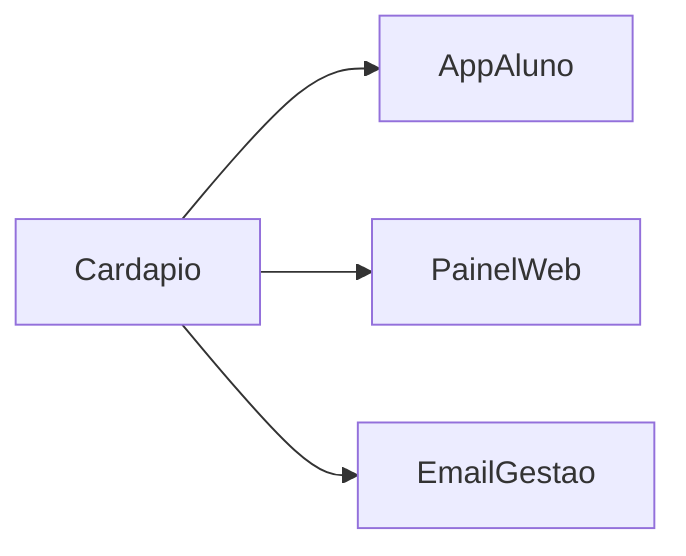
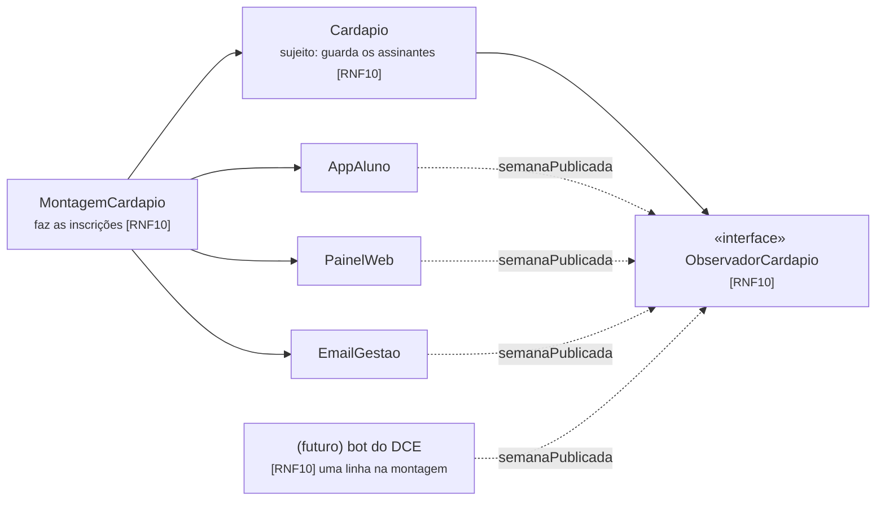

# C4 nível 3 · Cardápio e avisos

## Como estava (dado)

## Depois do pedido 4 (ADR-005)

(Na implementação os canais são assinados por referência de método, então satisfazem
`ObservadorCardapio` sem implementar a interface explicitamente.)

**Fronteira:** nenhuma seta de `Cardapio` para os canais; só `MontagemCardapio` os
conhece — `TestesFronteira.testCardapioSoAMontagemConheceOsCanais`.
