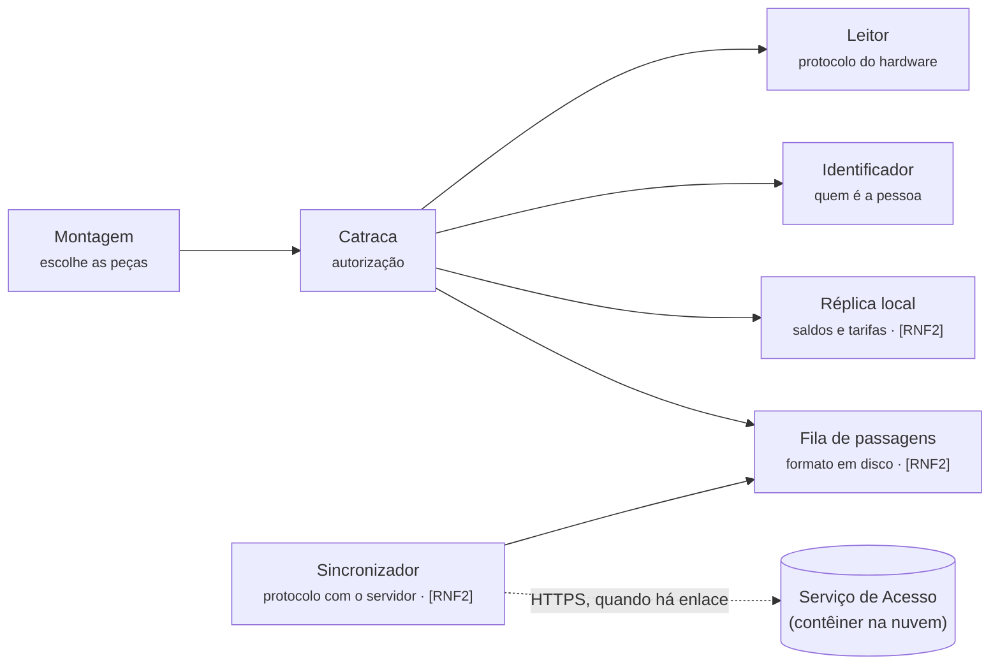
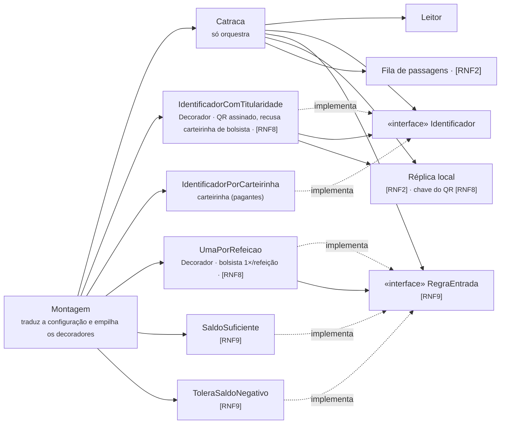

# C4 nível 3 · App da Catraca

## Como está (exemplo resolvido do ADR-001)

Cada seta vai de quem usa para quem é usado. Entre colchetes, o cenário da
especificação v2 que justifica o componente.

**Fronteira que o diagrama afirma:** nenhuma seta sai da Catraca em direção à
rede. Só o Sincronizador cruza a borda — e `TestesFronteira` prova isso.

## Depois dos pedidos 2 e 3 (ADR-003 e ADR-004)

A `Catraca` só depende das interfaces `Identificador` e `RegraEntrada`; todas as peças
novas entram por `Montagem`. Os decoradores usam apenas dados locais (réplica e
relógio), então o RNF2 continua valendo sem rede.
