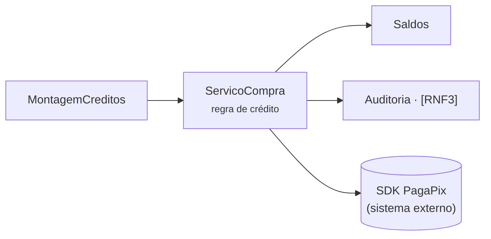
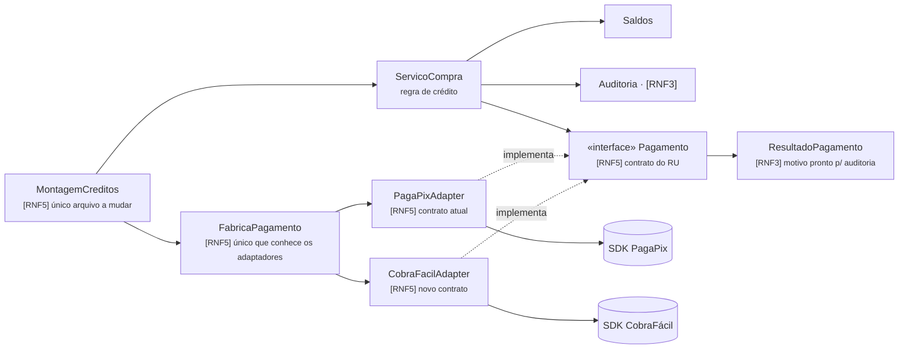

# C4 nível 3 · API de Créditos

## Como estava (dado)

## Depois do pedido 1 (ADR-002)

**Fronteira que o diagrama afirma:** nenhuma seta sai da regra de crédito para um SDK;
só os adaptadores (`ru.creditos.pagamento`) cruzam para `ru.gateways` — provado por
`TestesFronteira.testCreditosSoOsAdaptadoresUsamGateways`.
